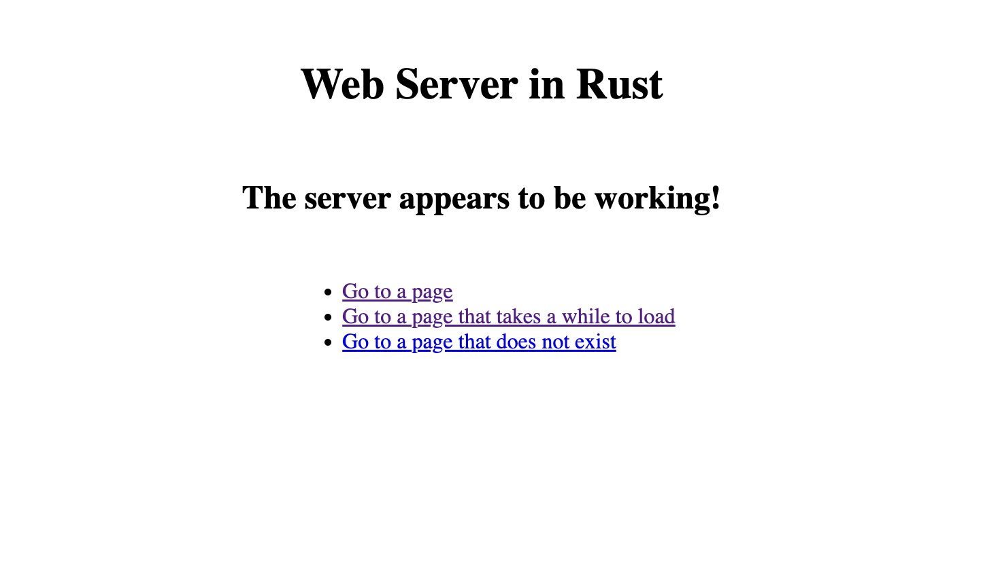

# Web Server in Rust
This is a multi-threaded web server built in Rust that can handle multiple concurrent requests. Test it locally by following the instructions below:

## Setup
Install Rust
```bash
curl https://sh.rustup.rs -sSf | sh
```
Clone the repository
```bash
git clone https://github.com/jonperk318/web-server-in-rust.git
```

## Run the Server
Run using Cargo
```bash
cd web-server-in-rust
cargo run
```
Open [http://localhost:8080](http://localhost:8080) with a web browser, and the following page should appear:





Explore the links to test different pages of the web server.


## Test the Server
Test the capabilities of the server with `curl`. Execute the first command in one terminal window and open up a second window to test the second command. Due to multi-threading, the server can handle up to 100 simultaneous requests.
```bash
curl -v localhost:8080/slow
```
```bash
curl -v localhost:8080/
```
Use the below command to see a 404 page.
```bash
curl -v localhost:3000/asdfghjkl
```


Finally, stop the server with `Ctrl+C`
